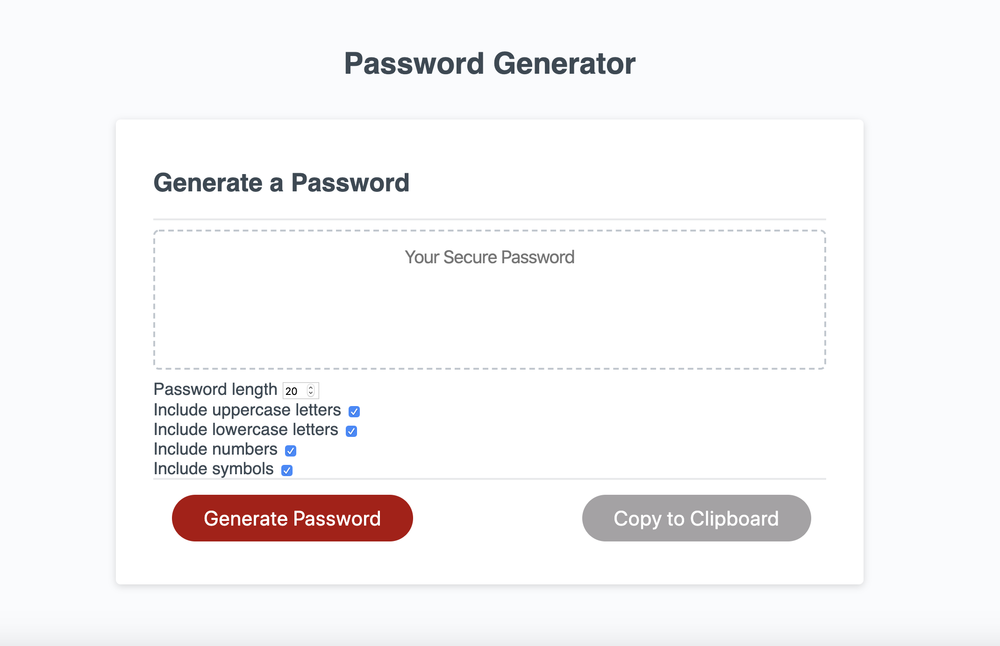

Homework 3: Password Generator  

Description:  

This is an application that generates a password based on user-selected criteria. HTML, CSS, and Javascript were used to build this.  

  

Directions:  
1. Select desired password length (must be between 8 and 128 characters)  
2. Select the character types used to generate the password  
3. Click the "Generate Password" button  
4. Click the "Copy to clipboard" button to copy the password  

Project files:  

    index.html  
    style.css  
    script.js  

Prerequisites:  
Browser that supports HTML5

Deployment:  
Download Repository  
Open index.html in browser

Built with:  
Visual Studio Code  
HTML  
CSS  
Javascript 

Authors:  
Ilana Shaffer

Acknowledgments:  
University of Denver - Bootcamp Spot Assignment